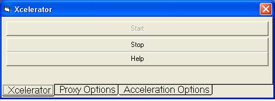



## Xcelerator\(Proxy Server Based Internet Accelerator\)

### Description

This code demonstrates the basics of a proxy server. It also demonstrates the basics of an internet accelerator

This code Accelerates your internet on slow websites. On websites with heavy traffic, it connects immediatly. On scientificsonline.com, my download went from 15 seconds to 1/2 a second. Although it downloads image files slightly slower, you won't notice a difference on dial-up connections.

You can also block websites. I blocked all VB-World advertisements. Simply block the add-host and no files are downloaded from the host. It also functions as a Proxy-Server because you can block words and websites.
 
### More Info
 
It requires the internet to be running. You also need to configure your browser. Instructions are included in the HELP file of Xcelerator which will come up the first time you run it.

Yahoo Mail will not work correctly while using Xcelerator, so you should disable it while using it. Also, image files will download slower. Also, you can only use HTTP while using Xcelerator.

             |
---                |---
**Submitted On**   |2002-12-26 09:37:52
**By**             |[John T\. Doe](https://github.com/Planet-Source-Code/PSCIndex/blob/master/ByAuthor/john-t-doe.md)
**Level**          |Advanced
**User Rating**    |4.0 (8 globes from 2 users)
**Compatibility**  |VB 5\.0, VB 6\.0
**Category**       |[Internet/ HTML](https://github.com/Planet-Source-Code/PSCIndex/blob/master/ByCategory/internet-html__1-34.md)
**World**          |[Visual Basic](https://github.com/Planet-Source-Code/PSCIndex/blob/master/ByWorld/visual-basic.md)
**Archive File**   |[Xcelerator15187912262002\.zip](https://github.com/Planet-Source-Code/john-t-doe-xcelerator-proxy-server-based-internet-accelerator__1-41879/archive/master.zip)

